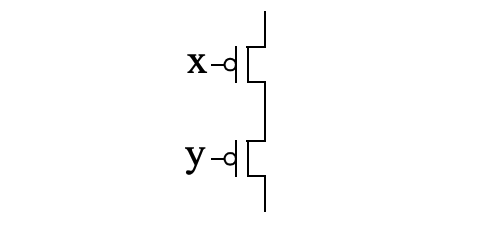

In the report, complete the following.
- Explain the objective of the problem.
- Give your solution.
- Include all your project codes in the [codes/assg](../../codes/assg) folder,
  if required.
- Explain your code snippets, if required.
- Include screenshots of the simulations in this folder, and insert them into
  the markdown file, if required.
- Explain why the simulations are correct, if required.

You can embed math equations into Github Markdown file using a [web service](https://www.codecogs.com/latex/eqneditor.php)

## (5 pts)
Describe the concept known as Moore’s Law.
Moore's Law is when the concept that the speed and capability of computers can be expected to double every two years. This increases in the number of transistors a microchip can contain.

## (5 pts)
Describe the behavior of the CMOS transistor
circuit shown below, clearly indicating
when the transistor circuit conducts.

If X is true, then the top part will conduct
If Y is true, then the bottom part will conduct
If both x and y are true, then the circuit will not coduct.
## (5 pts)
If we apply a voltage to the gate of a CMOS transistor, why doesn’t the current flow
to the transistor’s source or drain?
The current doesn't flow because for a pmos gate, if voltage is applied, the gate does not conduct.

## (5 pts)
 Why does applying a positive voltage to the gate of a CMOS transistor cause the
transistor to conduct between source and drain?

## (5 pts)
Which Boolean operation, AND, OR or NOT, is appropriate for each of the following:
- a. Detecting motion in any motion sensor surrounding a house (each motion sensor outputs 1 when motion is detected).
The boolean operation OR would appropriate detecting motion around different parts of a house.
- b. Detecting that three buttons are being pressed simultaneously (each button outputs 1 when a button is being pressed).
THe boolean AND would be appropriate to check if three buttons are being pressed.
- c. Detecting the absence of light from a light sensor (the light sensor outputs 1
when light is sensed).
The boolean operation NOT would be appropriate detecting for no light if the sensor outputs 1 if light is sensed.

## (5 pts)
Evaluate the Boolean equation F = (a AND b) OR c OR d for the given values of
variables a, b, c, and d:
- a. a=1, b=1, c=1, d=0
F= (1 AND 1) OR 1 OR 0 = 1
- b. a=0, b=1, c=1, d=0
F= (0 AND 1) OR 1 OR 0 = 1
- c. a=1, b=1, c=0, d=0
F = (1 AND 1) OR 0 OR 0 = 1
- d. a=1, b=0, c=1, d=1
F= (1 AND 0) OR 0 OR 0 = 0

## (5 pts)
Convert each of the following equations directly to gate-level circuits:
- a. F = ab’ + bc + c’
F = a + b + c'
- b. F = ab + b’c’d’
F = (a * b) + (b' * c' * d')
- c. F = ((a + b’) * (c’ + d)) + (c + d + e’)
F = a + b' + c + d + e'

## (5 pts)
We want to concisely describe the following situation using a Boolean equation. We
want to fire a football coach (by setting F=1) if he is mean (represented by M=1). If
he is not mean, but has a losing season (represented by the Boolean variable L=1),
we want to fire him anyways. Write an equation that translates the situation directly
to a Boolean equation for F, without any simplification.
F = M OR ((NOT M) and L)
